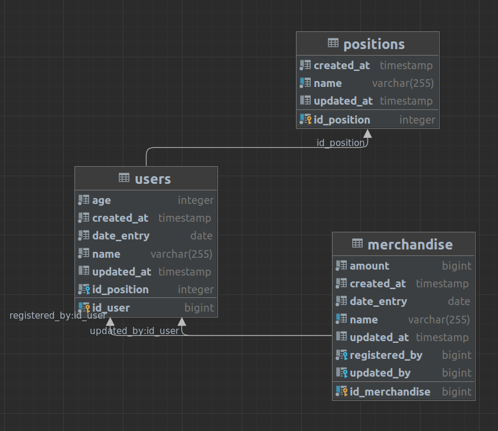

# Descripcion
Base de datos del sistema de inventario, se usa postgres con una imagen personalizada a partir del backup puesto en la raiz del proyecto.

## Modelo relacional
A continuacion se presenta el modelo relacional de la base de datos, se tiene tres tablas *positions*, *users* y *merchandise*:



La base de datos ya viene con algunos registros por defecto en todas las tablas para su respectivo uso.

## Acceso
Puede ingresar a la base de datos desde algun cliente externo, tenga en cuenta que sus credenciales por defecto seran: postgres:postgres

## Despliegue
Podemos desplegar la base de datos facilmente usando el docker compose añadido en la raiz del proyecto para ello use:

```shell
docker compose up
```

